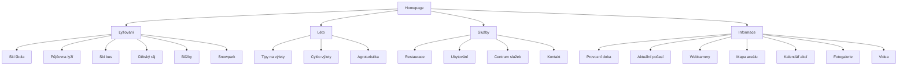

# UX/UI Design Document - SKI Kunčice

## High-Level UI/UX Design

### Design Philosophy
- **Moderní minimalistický design** s důrazem na snadnou navigaci a čitelnost
- **Sezónní adaptace** - obsah a vizuály se mění podle zimní/létní sezóny
- **Mobil-first přístup** s responzivním designem
- **Přírodní estetika** s horským tématem, ale bez přeplněnosti

### Color Palette
- **Primary**: #081f54 (tmavě modrá - důvěryhodnost, stabilita)
- **Secondary**: #da383a (červená - energie, akce)
- **Neutrals**: Bílá, šedé odstíny pro čitelnost
- **Akcenty**: Zelené pro přírodu, modré pro vodu/sníh

### Typography
- **Nadpisy**: Silné, čitelné fonty (Inter nebo podobný)
- **Text**: Čitelný bezserifový font
- **Velikosti**: Responsive škálování pro všechna zařízení

### Layout Principles
- **Grid systém**: Flexibilní 12-sloupcový grid
- **Spacing**: Konsistentní mezery pomocí Tailwind gap utilities
- **Cards**: Zaoblené rohy (rounded-4xl), stíny pro hloubku
- **Images**: Vysoké rozlišení, overlay efekty pro text

### Icons
- use icons from lucide-vue-next

## Sitemap in Mermaid Diagram Format

## Detailed Component Hierarchy

### Global Components
- **AppHeader**: Logo, navigace, mobilní menu, CTA tlačítko
- **AppFooter**: Kontakty, odkazy, partneři
- **AppLayout**: Wrapper pro všechny stránky

### Homepage Components
- **Hero**: Velký banner s titulkem, podtitulkem, sezónní obrázek
- **HeroBento**: Mřížka s rychlými odkazy (počasí, webkamery, mapa)
- **HomeServiceList**: Sezónní služby v mřížce karet
- **EventsSection**: Aktuální akce a události
- **PartnersSection**: Loga partnerů

### Shared Components
- **SeasonToggle**: Přepínač zima/léto
- **PageHeader**: Standardní hlavička stránek
- **MobileMenuSheet**: Mobilní navigace

### UI Components (shadcn-vue)
- Button, Dialog, Card, Badge, Avatar, etc.
- Všechny komponenty podporují dark mode a jsou plně přístupné

## Page-by-Page UX/UI Design Breakdown

### Homepage (/)
**User Stories:**
- Jako turista chci vidět atraktivní uvítací stránku, která mě přesvědčí o kvalitě areálu
- Jako návštěvník chci rychle najít základní informace o službách
- Jako rodina s dětmi chci vidět, že areál je vhodný pro všechny věkové kategorie

**Acceptance Criteria:**
- Hero sekce se načte během 2 sekund
- Bento grid obsahuje funkční odkazy na klíčové stránky
- Sezónní obsah se automaticky přepíná
- Mobilní verze zobrazuje všechny prvky bez horizontálního scrollování

**Technical Considerations:**
- Lazy loading pro obrázky v HeroBento
- Vue composables pro sezónní logiku
- Responsive grid systém pro různé velikosti obrazovek
- SEO optimalizace pro hero text

### Ski School (/lyzarska-skola)
**User Stories:**
- Jako rodič chci vidět informace o bezpečnosti výuky pro děti
- Jako začátečník chci pochopit, co škola nabízí
- Jako skupina chci možnost rezervace skupinové lekce

**Acceptance Criteria:**
- Ceník je jasně viditelný bez scrollování
- Kontaktní formulář validuje email a telefon
- Obrázky instruktorů mají alt texty pro přístupnost

**Technical Considerations:**
- Form validation pomocí Vue composables
- Image optimization pro rychlé načítání
- Schema.org markup pro lokální business

### Accommodation (/ubytovani)
**User Stories:**
- Jako turista chci filtrovat ubytování podle ceny a vybavení
- Jako rodina chci vidět kapacitu pokojů
- Jako skupina chci možnost hromadné rezervace

**Acceptance Criteria:**
- Filtrovací možnosti fungují bez reload stránky
- Detail pokoje zobrazuje všechny fotografie
- Rezervační formulář ukládá průběh do localStorage

**Technical Considerations:**
- Vue Router pro navigaci mezi seznamem a detailem
- Infinite scroll pro dlouhé seznamy
- Real-time availability check

### Events (/kalendar-akci)
**User Stories:**
- Jako turista chci vidět nadcházející akce v kalendáři
- Jako účastník chci možnost registrace na akci
- Jako organizátor chci přehled registrovaných účastníků

**Acceptance Criteria:**
- Kalendář se načítá během 1 sekundy
- Filtrování podle typu akce funguje okamžitě
- Registrační formulář odesílá data bezpečně

**Technical Considerations:**
- Calendar komponenta s Vue 3
- Real-time updates pomocí WebSockets
- GDPR compliant data handling

### Contact (/kontakt)
**User Stories:**
- Jako turista chci snadno najít kontaktní informace
- Jako zákazník chci možnost rychlé konzultace
- Jako handicapovaný návštěvník chci informace o přístupnosti

**Acceptance Criteria:**
- Mapa se načte bez chyb
- Kontaktní formulář má všechna povinná pole
- Telefonní čísla jsou klikatelné na mobilech

**Technical Considerations:**
- Google Maps integration s lazy loading
- Form validation s custom pravidly
- Accessibility compliance (WCAG 2.1)

### Restaurant (/restaurace)
**User Stories:**
- Jako host chci vidět aktuální menu
- Jako skupina chci možnost rezervace stolu
- Jako alergik chci informace o alergenech

**Acceptance Criteria:**
- Menu se aktualizuje denně
- Rezervační systém kontroluje dostupnost
- Fotografie jídel mají popisky

**Technical Considerations:**
- CMS integration pro menu management
- Reservation API s conflict resolution
- Image CDN pro rychlé načítání

### Current Weather (/aktualni-pocasi)
**User Stories:**
- Jako lyžař chci vidět aktuální sněhové podmínky
- Jako turista chci předpověď na více dní
- Jako plánovač chci upozornění na změny počasí

**Acceptance Criteria:**
- Data se aktualizují každých 15 minut
- Předpověď zobrazuje 7 dní dopředu
- Offline režim funguje s cached daty

**Technical Considerations:**
- Weather API integration
- Service Worker pro offline funkcionalnost
- Real-time updates pomocí SSE

### Webcams (/webkamery)
**User Stories:**
- Jako lyžař chci vidět aktuální stav svahu
- Jako turista chci živé záběry z areálu
- Jako plánovač chci archiv záznamů

**Acceptance Criteria:**
- Stream se načte během 3 sekund
- Multiple kamery přepínatelné bez lagu
- Playback archivních záznamů plynulý

**Technical Considerations:**
- HLS streaming pro kompatibilitu
- Adaptive bitrate pro různé připojení
- CDN pro globální distribuci

## Technical Considerations for Frontend Development

### Performance
- **Image Optimization**: WebP formát, lazy loading, responsive images
- **Bundle Splitting**: Code splitting pro různé sekce aplikace
- **Caching Strategy**: Service Worker pro offline funkcionalnost
- **CDN Integration**: Pro globální distribuci assets

### Accessibility
- **WCAG 2.1 AA Compliance**: Screen reader support, keyboard navigation
- **Color Contrast**: Minimum 4.5:1 ratio pro text
- **Focus Management**: Visible focus indicators, logical tab order
- **Semantic HTML**: Proper heading hierarchy, ARIA labels

### SEO & Social Sharing
- **Meta Tags**: Dynamic meta tags pro každou stránku
- **Structured Data**: Schema.org markup pro lokální business
- **Open Graph**: Social media sharing optimization
- **Sitemap & Robots**: Automatic generation

### Mobile Experience
- **Touch Targets**: Minimum 44px velikost pro touch prvky
- **Swipe Gestures**: Native-like scrolling a navigation
- **Offline Support**: Core funkcionalita bez internetu
- **Progressive Enhancement**: Graceful degradation

### Browser Support
- **Modern Browsers**: Chrome, Firefox, Safari, Edge (poslední 2 verze)
- **Mobile Browsers**: iOS Safari, Chrome Mobile
- **Fallbacks**: CSS Grid fallbacks pro starší browsery

## Additional Feature Recommendations

### 1. Personalizovaný Dashboard s AI Doporučeními
**Popis**: Inteligentní dashboard, který se učí z uživatelských preferencí a nabízí personalizované tipy na aktivity.
**UX Vylepšení**:
- Adaptivní rozložení s drag-and-drop widgety
- AI-powered doporučení na základě počasí a historie návštěv
- Quick actions pro rychlé rezervace
**Technické Aspekty**: Machine learning pro predikci preferencí, real-time data synchronization

### 2. Immersive 360° Virtual Tours
**Popis**: Virtuální prohlídky areálu pomocí 360° fotografií a videí.
**UX Vylepšení**:
- Interaktivní hotspoty s informacemi o bodech zájmu
- Seamless přechody mezi zimní/léta sezónou
- AR overlay pro mobilní zařízení
**Technické Aspekty**: WebGL rendering, progressive loading pro rychlé načítání

### 3. Smart Reservation System s Dynamic Pricing
**Popis**: Inteligentní rezervační systém s dynamickým cenotvorbou na základě poptávky.
**UX Vylepšení**:
- Real-time availability s visual calendar
- Price comparison s konkurenčními areály
- Automated upsell suggestions (např. "Přidejte skipas za zvýhodněnou cenu")
**Technické Aspekty**: Real-time inventory management, AI pricing algorithms

### 4. Community-Driven Content Platform
**Popis**: Sociální platforma pro sdílení zážitků, recenzí a tipů od návštěvníků.
**UX Vylepšení**:
- User-generated content s photo/video galleries
- Trust-based review systém s verified badges
- Community challenges a achievement badges
**Technické Aspekty**: Content moderation AI, social graph algorithms

### 5. Advanced Weather Integration s Predictive Analytics
**Popis**: Pokročilá meteorologická integrace s prediktivní analytikou pro plánování.
**UX Vylepšení**:
- 14-denní předpověď s hourly breakdown
- Snow condition predictions s AI accuracy indicators
- Personalized weather alerts ("Ideální podmínky pro carving za 2 hodiny")
**Technické Aspekty**: Multiple weather APIs integration, machine learning pro predikce

### 6. Gamified Loyalty Program
**Popis**: Herní systém odměn s achievementy a levely pro opakované návštěvy.
**UX Vylepšení**:
- Progress bars a achievement unlocks
- Social leaderboards pro sezónní výzvy
- Digital loyalty card s NFC integration
**Technické Aspekty**: Blockchain-based token systém, gamification engine

### 7. Real-time Capacity Monitoring
**Popis**: Live monitoring kapacity vleků, restaurací a parkovišť.
**UX Vylepšení**:
- Color-coded capacity indicators (zelená = volno, červená = plno)
- Wait time predictions s AI
- Smart routing suggestions ("Vyhněte se vleku A, použijte B")
**Technické Aspekty**: IoT sensor integration, real-time data processing

### 8. Augmented Reality Navigation
**Popis**: AR navigace po areálu s overlay informacemi na kameru telefonu.
**UX Vylepšení**:
- Live camera overlay s waypoints a informacemi
- Voice-guided navigation v češtině a angličtině
- Emergency AR markers pro bezpečnost
**Technické Aspekty**: ARCore/ARKit integration, GPS accuracy enhancement

### 9. Sustainable Tourism Dashboard
**Popis**: Dashboard pro sledování ekologické stopy a udržitelných aktivit.
**UX Vylepšení**:
- Carbon footprint tracker s tipy na snížení
- Eco-friendly activity recommendations
- Community impact visualization
**Technické Aspekty**: Environmental data APIs, sustainability metrics calculation

### 10. AI-Powered Trip Planning Assistant
**Popis**: Inteligentní asistent pro plánování celého výletu od A do Z.
**UX Vylepšení**:
- Conversational interface s natural language processing
- Multi-day itinerary planning s weather integration
- Smart suggestions pro kombinaci aktivit (lyžování + restaurace + ubytování)
**Technické Aspekty**: NLP processing, constraint optimization algorithms

---

*Tento dokument je navržen pro implementaci v Laravel + Vue.js + Tailwind CSS stacku s důrazem na výkon, přístupnost a uživatelskou zkušenost.*